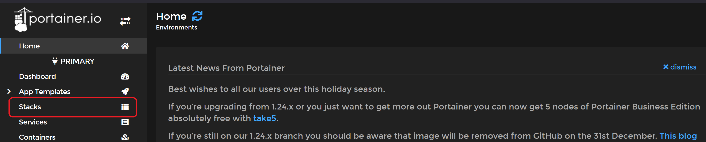
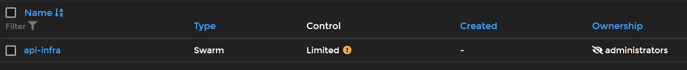
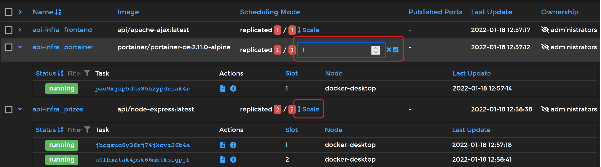

# Objectifs

L'objectif de cette étape est de modifier l'infrastructure pour y mettre en place :
- Load balancing
- Dynamic cluster
- Sticky sessions
- Interface de gestion

# Configuration

Les trois premiers points peuvent facilement être mis en place en utilisant [Traefik](https://doc.traefik.io/traefik/) comme `reverse proxy`. Les deux premiers étant automatiquement géré, la difficulté principale consiste à configurer `Traefik` correctement.

Quant au dernier, [Portainer](https://www.portainer.io/) permet de fournir une interface graphique pour gérer l'infrastructure.

Pour simplifier la mise en place de l'infrastructure, nous allons utiliser [docker compose](https://docs.docker.com/compose/) pour décrire la configuration.

[La configuration](../docker-images/traefik-reverse-proxy/docker-compose.yml) de l'infrastructure définit quatres services différents, à savoir `reverse-proxy`, `portainer`, `prizes`, `frontend`. Les deux derniers services sont basés sur les images des étapes 3 & 4 avec quelques modifications supplémentaires décrites plus bas.

## Traefik

Pour configurer `Traefik`, il est au minimum nécessaire de définir un `entrypoint` qui sera utilisé pour accéder aux services, un `provider` (docker dans notre cas) ainsi qu'un mapping de port pour pouvoir y accéder depuis notre machine locale :

``` yaml
services:
  [...]
  reverse-proxy:
    [...]
    ports:
      - "8080:80"
    command:
      - --entrypoints.web.address=:80
      - --providers.docker
```

L'utilisation de `docker` en tant que `provider` nécessite également d'ajouter un volume spécifiant le socket utilisé pour la communication :

``` yaml
services:
  [...]
  reverse-proxy:
    [...]
    volumes:
      - /var/run/docker.sock:/var/run/docker.sock
```

## Server HTTP statique

La mise en place de `Traefik` étant presque automatique, il suffit de spécifier les paramètres voulus dans la catégorie `labels` du service.

``` yaml
services:
  [...]
  frontend:
    [...]
    labels:
      # Active Traefik pour ce service
      - traefik.enable=true

      # Intercepte les requêtes destinées à api.labo.ch
      - traefik.http.routers.frontend.rule=Host(`api.labo.ch`)

      # Utilise l'entrypoint web (défini plus haut)
      - traefik.http.routers.frontend.entrypoints=web

      # Utilisation de sticky sessions
      - traefik.http.services.frontend.loadbalancer.sticky.cookie=true
```

## Server HTTP dynamique

La configuration de ce service nécessite, en plus d'activer `Traefik` et de définir l'`entrypoint`, de spécifier le port sur lequel rediriger la requête ainsi que son URL. 

Notre serveur dynamique s'attend à recevoir des requêtes sur le port `3000` à l'URL racine (`/`). Or, nous allons y accéder depuis une URL différente (`/api/prize`). Il faut donc rajouter un `middleware` avant la redirection se chargeant de réécrire l'URL correctement.

``` yaml
services:
  [...]
  prizes:
    [...]
    labels:
      - traefik.enable=true
      - traefik.http.routers.prizes.entrypoints=web

      # Port sur lequel la requête est redirigée
      - traefik.http.services.prizes.loadbalancer.server.port=3000

      # Spécification du chemin pour accéder au service
      - traefik.http.routers.prizes.rule=Host(`api.labo.ch`) && PathPrefix(`/api/prize`)

      # Middleware pour supprimer le prefix /api/prize
      - traefik.http.routers.prizes.middlewares=prizes-prefix-remover
      - traefik.http.middlewares.prizes-prefix-remover.stripprefix.prefixes=/api/prize
      - traefik.http.middlewares.prizes-prefix-remover.stripprefix.forceSlash=false
```

## Portainer

L'utilisation de `Portainer` nécessite deux choses. Il faut d'abord configurer correctement le service en y spécifiant la ligne `command` puis ajouter un `volume` :

``` yaml
services:
  [...]
  portainer:
    [...]
    command: -H unix:///var/run/docker.sock
    volumes:
      - /var/run/docker.sock:/var/run/docker.sock
      - portainer_data:/data

[...]
volumes:
  portainer_data:
```

Ensuite, il suffit de configurer `Traefik` de la même manière que précédemment. Pour pouvoir y accéder depuis une URL particulière (`/ui`) il est nécessaire d'utiliser des middlewares. Pour rendre l'interface accessible via une URL particulière, il est nécessaire d'utiliser des middlewares particuliers comme indiqué [ici](https://community.traefik.io/t/fixed-how-to-add-the-missing-trailing-slash-redirectregex-stripprefixregex-no-need-for-replacepathregex/3816/6).

``` yaml
services:
  [...]
  portainer:
    [...]
    labels:
      - traefik.enable=true
      - traefik.http.routers.portainer.entrypoints=web
      - traefik.http.services.portainer.loadbalancer.server.port=9000
      - traefik.http.routers.portainer.rule=Host(`api.labo.ch`) && PathPrefix(`/ui`)

      # Nécessaire pour accéder à l'interface avec l'URL /ui
      - traefik.http.routers.portainer.middlewares=portainer-prefix-remover
      - traefik.http.middlewares.portainer-prefix-remover.chain.middlewares=strip-prefix-1,strip-prefix-2
      - traefik.http.middlewares.strip-prefix-1.redirectregex.regex=^(https?://[^/]+/[a-z0-9_]+)$$
      - traefik.http.middlewares.strip-prefix-1.redirectregex.replacement=$${1}/
      - traefik.http.middlewares.strip-prefix-1.redirectregex.permanent=true
      - traefik.http.middlewares.strip-prefix-2.stripprefixregex.regex=/[a-z0-9_]+
```

# Modifications apportées

Pour vérifier que les différentes fonctionnalités fonctionnent correctement, nous avons affiché les noms d'hôtes des serveurs traitants les différentes requêtes.

Concernant le serveur statique, nous avons affiché le nom d'hôte sur la page grâce à l'instruction php `<?php print gethostname(); ?>`. Le fichier `index` a donc dû être renommer vers l'extension `.php`.

Le serveur dynamique, quant à lui, se contente de rajouter un paramètre `hostname` à la requête HTTP de réponse :

```javascript
var os = require("os");

app.use(function (req, res, next) {
	res.header("hostname", os.hostname());
	next();
});
```

Ce paramètre est ensuite récuperé lorsque la requête AJAX est accomplie grâce à la fonction `getResponseHeader("hostname")` de l'objet de réponse : 

```javascript
$.ajax({
    // [...]
}).done((prize, textStatus, jqXHR) => {
    // [...]
    text += "\nVous avez été servi par " + jqXHR.getResponseHeader("hostname");
});
```

# Utilisation

Comme nous utilisons les images des étapes 3 & 4, il est nécessaire de les construire au préalable grâce à la commande `docker compose build`. Le fichier `hosts` doit avoir été modifié comme décrit dans l'étape 3.

Pour pouvoir profiter plainement de `Portainer`, nous allons devoir créer une `stack` avec `docker compose`, ce qui nécessite l'activation de `docker swarm` à l'aide de la commande : `docker swarm init`

A la création de la stack, les différents services seront lancés automatiquement.

Marche à suivre :

1. Créer la stack
    - `docker stack deploy --compose-file ./docker-compose.yml api-infra`
2. Accéder à `api.labo.ch:8080` pour le serveur statique
3. Accéder à `api.labo.ch:8080/api/prize` pour le serveur dynamique
4. Accéder à `api.labo.ch:8080/ui` pour l'interface de gestion `Portainer`
5. Ajouter des services
    - `docker service scale api-infra_prizes=2`

Pour arrêter l'infrastructure, il suffit de supprimer la stack : `docker stack rm api-infra`

# Gestion via l'interface

1. Accéder à  `api.labo.ch:8080/ui` 
2. Sélectionner `Stacks` sur le menu de gauche

3. Sélectionner la stack créée précédemment

4. Modifier le nombre d'instance des services


# Procédures de tests

- Interface de gestion
  1. Créer la stack
  2. Accéder à `api.labo.ch:8080/ui`
  3. Dupliquer des services `prizes` et `frontend`
  4. Vérifier que les containers soient lancés et ajoutés à la stack

- Load balancing & Dynamic cluster
  1. Créer une stack
  2. Dupliquer des services `prizes` via `api.labo.ch:8080/ui`
  3. Accéder à `api.labo.ch:8080`
  4. Vérifier que le nom d'hôte affiché change entre plusieurs requêtes

- Sticky sessions
  1. Créer une stack
  2. Dupliquer des services `frontend` via `api.labo.ch:8080/ui`
  3. Accéder à `api.labo.ch:8080`
  4. Vérifier que le nom d'hôte affiché ne change pas tant que les cookies ne sont pas supprimés
  5. Vider les cookies et rafraîchir la page jusqu'à être servi par un autre serveur